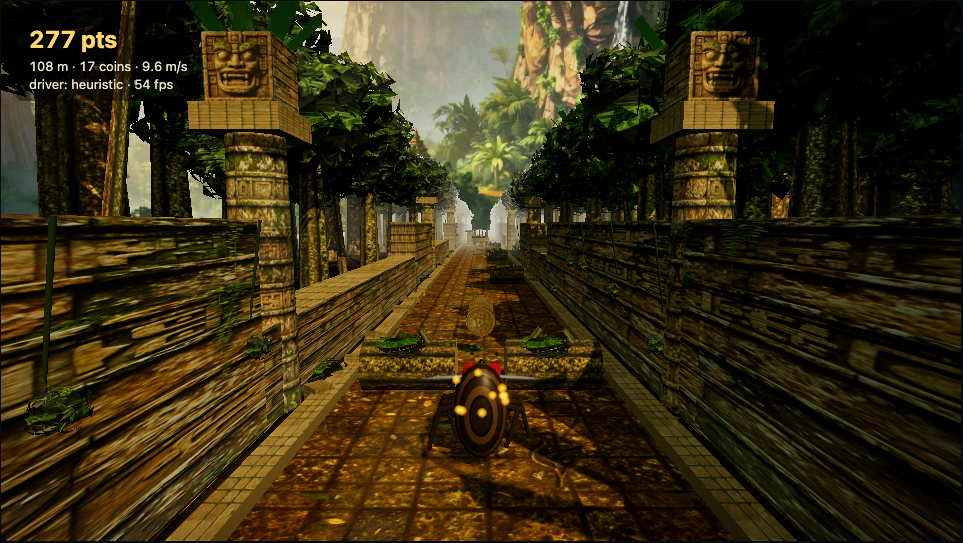

# FlyRunner

An original 3-lane endless runner, plus an AI agent whose neural network **topology is
constrained by the real wiring diagram of the *Drosophila melanogaster* male CNS connectome**
(MaleCNS v1.0), trained with reinforcement learning to play it. Hobby project, just wanted to see how far I could get with vibe-coding. 

## Tech stack

- **Game / engine** — TypeScript, Vite, Vitest. Deterministic headless engine with a 36-float state API and a 64×48 software-rasterised retinal frame.
- **Rendering** — three.js (PBR materials, shadow maps, EffectComposer bloom + colour grade), Canvas2D fallback.
- **Art pipeline** — Higgsfield (Z Image model via `@higgsfield/cli`) for the texture and sky paintings; seamless tiling and normal/roughness maps from the Higgsfield skills' texture post-processing scripts (NumPy/Pillow).
- **Connectome pipeline** — Python 3.12, uv, NumPy, pandas, PyArrow; MaleCNS v1.0 bulk files.
- **Substrate / training** — PyTorch (MLX on Apple silicon), flyvis, Gymnasium, PPO and CMA-ES.

## The game



A temple-ruin path through the jungle, three lanes, an explorer sprinting down it, chase camera.
Obstacles: a fallen log (`LOW` — jump), a spiked stone beam (`HIGH` — slide), a carved stone
block (`FULL` — change lane). Gold coins are pickups. Speed ramps with distance and is capped.
The track generator always leaves a way through.

Rendered with three.js: procedural geometry dressed in AI-generated PBR texture sets
(`game/public/textures/`, made with Higgsfield's Z Image model and post-processed into seamless
tiles with normal/roughness maps), real-time sun shadows, a painted jungle sky backdrop, bloom and
a colour grade. The renderer is purely cosmetic; the engine and the agents never see it. A 2D
canvas fallback (`?renderer=2d`) kicks in if WebGL is unavailable.

Keys: `↑`/`Space` jump · `↓` slide · `←`/`→` lane · `R` restart · `P` pause.

URL parameters for demos and automation: `?driver=heuristic|random|human&seed=42&skip=30&renderer=2d`
(`skip` fast-forwards that many seconds of simulated play before the first frame).

### Programmatic action API (`game/src/engine`)

```ts
import { Runner, VecRunner, STATE_SIZE, STATE_LAYOUT } from "./engine";

const r = new Runner(seed);
r.jump(); r.slide(); r.moveLeft(); r.moveRight();   // or r.act("jump")
const res = r.step();            // exactly one tick at DT = 1/60; {alive, crashed, coins, dz}
const s = r.getState();          // Float32Array(36), every entry in [-1, 1]
const f = r.getFrame();          // Uint8Array(64*48) grayscale, software-rasterised view
r.reset(seed);
const v = new VecRunner(256);    // lock-step batch with auto-reset
```

`getState()` layout (`STATE_LAYOUT` names each index):

| index | meaning |
|---|---|
| 0–2 | lane one-hot |
| 3 | lateral offset (−1…1) |
| 4, 5 | airborne flag, jump phase |
| 6, 7 | sliding flag, slide phase |
| 8 | speed / max speed |
| 9–32 | per lane × next 2 obstacles: `[isLow, isHigh, isFull, distance/40]` (`0,0,0,1` if none) |
| 33–35 | per lane: distance to nearest pickup / 40 (1 if none) |

The engine has no DOM dependency and is deterministic given a seed: `fixtures/golden.json`
records reference trajectories that the TypeScript engine and the planned NumPy port
(`flybrain/env`) must both reproduce. The canvas renderer is cosmetic only.

Headless throughput on the M5 (single Node process): ~4.2M steps/s bare, ~2.0M with the scripted
agent + `getState()`, ~50k with `getFrame()`.

## Setup

Requirements: Node ≥ 20, [uv](https://docs.astral.sh/uv/). Tested on an Apple M5 / 32 GB.

```bash
# game
cd game && npm install
npm run dev          # http://localhost:5173 — play with the keyboard, or pick a scripted driver
npm test             # engine tests incl. the golden-trajectory fixture
npm run bench        # headless throughput
npm run build        # static bundle in game/dist

# flybrain (uv installs Python 3.12 itself; flyvis does not support 3.13+)
cd flybrain && uv sync --extra dev
uv run pytest
uv run flybrain bench-backend --out ../docs/bench-backend.md
uv run flybrain download        # MaleCNS v1.0 bulk files (~1.2 GB, public GCS bucket) + sha256 manifest
uv run flybrain build-graph     # → data/graph/v0/{nodes,edges,pool_nodes,pool_edges}.parquet + manifest.json (12 s)
uv run flybrain graph-report    # per-type table, degrees, memory estimate
(cd ../game && npm run dump-states)   # 20k game states for calibration → flybrain/data/cache
uv run flybrain calibrate [--per-neuron] [--dynamics lif]   # input-gain × synapse-scale sweep → data/graph/v0/calibration_*.json
uv run flybrain bench-substrate                              # fwd+bwd throughput of the real substrate
uv run flybrain eval --agent heuristic                       # scripted / random baselines on 200 held-out seeds
uv run flybrain train --name mlp --agent mlp --minutes 15                        # PPO MLP baseline
uv run flybrain train --name fly_ro --agent fly --graph pooled --stage readout   # connectome, substrate frozen
uv run flybrain train --name fly --agent fly --graph pooled --stage full --scale-max 8   # + substrate free params
uv run flybrain train --name ctl --agent fly --control shuffled|random|silenced  # controls, same code path
uv run flybrain eval --run runs/fly                          # held-out evaluation → runs/fly/eval.json
uv run flybrain export --run runs/fly                        # → ../game/public/agents/fly.json (+ index.json) for the live demo
```

## The connectome subgraph

`flybrain/data/graph/v0` is a versioned artifact built from the MaleCNS v1.0 bulk files by
cell-type allowlist → synapse threshold (≥ 5) → optic-lobe column patch (hex radius 3) →
input→output reachability prune → neurotransmitter sign. It covers the early visual system
(R1–R8, lamina, medulla, T4/T5), looming detectors (LC4/LC6/LPLC1/LPLC2/LC11), HS/VS, the
anterior visual pathway into the compass (MeTu → TuBu → ring neurons), the central complex
(EPG, PEN, Δ7, hΔ/vΔ, PFL2/3) and 20 descending-neuron types. Every step, count, resolved type
name and input checksum is in `manifest.json`; the design doc §4 explains each choice and what
the first build got wrong. A neuPrint token is not required.

## The substrate

`flybrain/src/flybrain/model/` — a rate network in the flyvis form (`τ dV/dt = −V + b + W·relu(V) + x`)
whose edge set, synapse counts and neurotransmitter signs are frozen to the graph above. Free
parameters: per-cell-type time constant and bias, per-synapse-class weight scale (sign can never
flip), a small input encoder (game state → photoreceptor/lamina drive, or a fixed retinotopic
sampling of the 64×48 frame), and a linear readout from descending-neuron activity to the five
actions. A surrogate-gradient LIF variant sits behind `dynamics="lif"`. Controls built from the same
loader: degree-preserving shuffled topology, size-matched random graph, silenced input, and
readout-only training.

## Training

`flybrain/src/flybrain/env/engine.py` is a statement-for-statement Python port of the TypeScript
engine, checked against `game/fixtures/golden.json` (same PRNG stream, same states to 2e-6);
`VecFlyRunner` steps N of them in lock-step at 15 Hz decisions (4 engine ticks per action) with
reward = metres + 5·coins − 50·crash − 0.05·lane change and a 180 s cap. One PPO implementation
trains both the stateless MLP baseline and the recurrent connectome agent (truncated BPTT through
the substrate over each 32-step rollout, state reset at episode boundaries, optional clamp on the
synapse scales); an OpenAI-style evolution strategy is the gradient-free fallback. Evaluation is
always the same: 200 held-out seeds, greedy actions, 180 s cap, distance distribution and
survival-to-cap rate.

## Results (2026-09-14)

Fixed protocol for every agent: 200 held-out seeds, greedy actions, 180 s cap (cap distance
3,409 m). Full table, curves and interpretation in [DESIGN.md §6.1](DESIGN.md).

| agent | training decisions | distance mean | median | survive cap |
|---|---|---|---|---|
| random | – | 36 m | 28 | 0.00 |
| scripted heuristic (15 Hz) | – | 1,209 m | 952 | 0.01 |
| MLP-PPO, 30 min | 9.5 M | 955 m | 655 | 0.04 |
| **MLP-PPO, 75 min total** | 16 M | **1,954 m** | 2,579 | **0.47** |
| connectome, pooled graph (261 nodes), readout-only | 2.2 M | 49 m | 40 | 0.00 |
| connectome, pooled graph, substrate trained | 1.8 M | 55 m | 48 | 0.00 |
| connectome, per-neuron graph (3,678 cells), readout-only, 45 min | 1.0 M | 37 m | 29 | 0.00 |
| connectome, per-neuron, distilled from the MLP (substrate trainable) | 9 M imitation | 111 m | 91 | 0.00 |
| … + PPO fine-tune, 45 min | +3.4 M | 65 m | 55 | 0.00 |
| connectome, per-neuron, DAgger from the MLP, substrate trainable, 4 h | 1.5 M states × 8 iters | 232 m | 186 | 0.00 |
| **… continued, 8 h total** | +1.4 M states × 8 iters | **317 m** | 218 | 0.00 |
| control: shuffled topology (PPO, pooled) | 2.4 M | 37 m | 29 | 0.00 |
| control: random graph (PPO, pooled) | 2.4 M | 40 m | 36 | 0.00 |
| control: silenced input (PPO, pooled) | 2.2 M | 37 m | 29 | 0.00 |
| **topology test, identical DAgger protocol from scratch, 6 h, per-neuron:** | | | | |
| real MaleCNS wiring | 6 iters | 188 m | 164 | 0.00 |
| degree-preserving shuffled wiring | 6 iters | **423 m** | 306 | 0.00 |
| random graph, same size and density | 6 iters | **465 m** | 319 | 0.00 |

**Limitations.** Single machine, minutes-to-an-hour of training per run, one seed per condition,
runs sharing CPU; the `frame` (retinotopic) input path is implemented but untrained; no human
baseline collected yet (keyboard mode exists); no track turns. None of this says anything about
what a real fly's brain computes.

## Licences and attribution

- Code in this repository: MIT (see `LICENSE`).
- **MaleCNS v1.0** connectome data (male-cns.janelia.org): **CC BY 4.0**. Credit: FlyEM (HHMI
  Janelia Research Campus), University of Cambridge Department of Zoology, MRC Laboratory of
  Molecular Biology, and Google Research. Data is queried at run time via neuPrint and is not
  redistributed here; derived graph artifacts under `flybrain/data/graph` carry a manifest with
  the dataset version and query.
- **flyvis** (Lappalainen et al., *Nature* 2024; TuragaLab/flyvis, MIT) is used for the
  connectome-constrained parametrisation and, optionally, as a pretrained visual front end.
- Prior art we learned from: `nftechie/doomfly`, `cobanov/flyjump` (Fly Dino),
  `liuzihe02/fly-craftax`, `TuragaLab/flybody`, `cobanov/awesome-fly`.
- This project is independent and unaffiliated with, and not endorsed by, the MaleCNS authors,
  the flyvis/flybody authors, Imangi Studios, or anyone else. All game art and code are original;
  no third-party game assets or trademarks are used.
