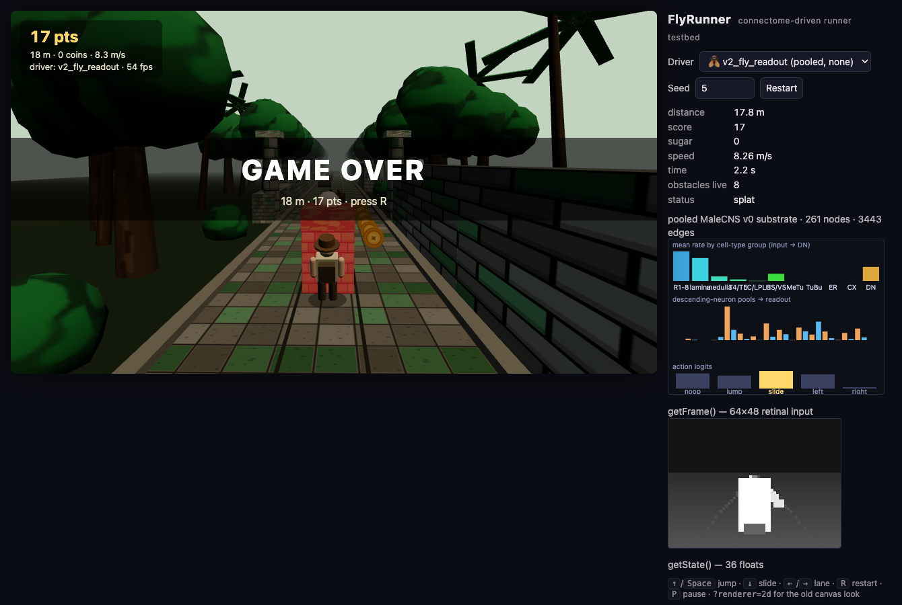

# FlyRunner

An original 3-lane endless runner, plus an AI agent whose neural network **topology is
constrained by the real wiring diagram of the *Drosophila melanogaster* male CNS connectome**
(MaleCNS v1.0), trained with reinforcement learning to play it.

> **What this is and isn't.** A connectome is a static structural wiring diagram: which neurons
> synapse onto which, with how many synapses, and (where annotated) a predicted neurotransmitter
> sign. It is not a set of trained weights and it contains no live neural dynamics. Here we freeze
> a network's *connectivity* to a task-relevant MaleCNS subgraph, leave a small set of
> biologically-unmeasured parameters free (per-synapse-class weight scale, per-cell-type time
> constants and biases, plus a small readout), and optimise those with RL until the network plays
> the game. That is an interesting, legitimate "connectome-constrained controller" experiment. It
> is **not** a simulation of a fly's mind, and nothing about its game score says anything about
> real fly cognition. See [DESIGN.md](DESIGN.md) for the full rationale and the controls that keep
> the claims honest.

Independent hobby/research project. Not affiliated with or endorsed by the MaleCNS authors,
the flyvis/flybody authors, or any game studio.

## Layout

```
game/       TypeScript. The runner: deterministic headless engine + action API, canvas renderer,
            human keyboard mode, scripted/random baseline agents, tests, throughput bench.
flybrain/   Python 3.12 (uv). Connectome pipeline (neuPrint → versioned graph artifact),
            connectome-constrained substrate, Gymnasium env, PPO/CMA-ES training, backend bench.
docs/       Benchmarks, screenshots, and the two-page write-up (docs/writeup.tex → writeup.pdf; `brew install tectonic && tectonic docs/writeup.tex`).
DESIGN.md   Design doc: subgraph selection, RL choice, MLX-vs-PyTorch decision, milestones.
```

## Status

| Phase | State |
|---|---|
| 0 Scaffold | done |
| 1 Runner game + action API | **done** — playable (three.js), tested, headless ≈ 2M steps/s |
| 2 Connectome pipeline | **done** — `flybrain build-graph` → `flybrain/data/graph/v0` (3.7k neurons / 69k edges; 261-node pooled graph), fully manifested |
| 3 Substrate | **done** — flyvis-form rate/LIF network with frozen v0 topology, state/frame encoders, linear + fixed DN readouts, shuffled/random/silenced controls, calibration sweep; 51k (pooled) / 1.5k (per-neuron) env-decisions/s on MPS |
| 4 Training | **built, first results in** — MLP-PPO 955 m mean after 30 min (heuristic 1,209 m); pooled-graph connectome agent 49–55 m, not separable from controls beyond a free "always slide" trick (DESIGN.md §6.1); per-neuron run in progress |
| 5 Live demo | **done** — trained agents exported to JSON and run natively in the browser (`flybrain export`), selectable next to human/heuristic/random; live connectome-activity panel (cell-type groups → DN pools → action logits) |
| 6 Evaluation | **written up** below and in DESIGN.md §6.1 — with controls; connectome agent is a null result at this scale |

## Setup

Requirements: Node ≥ 20, [uv](https://docs.astral.sh/uv/). Tested on an Apple M5 / 32 GB.

```bash
# game
cd game && npm install
npm run dev          # http://localhost:5173 — play with the keyboard, or pick a scripted driver
npm test             # engine tests incl. the golden-trajectory fixture
npm run bench        # headless throughput
npm run build        # static bundle in game/dist

# flybrain (uv installs Python 3.12 itself; flyvis does not support 3.13+)
cd flybrain && uv sync --extra dev
uv run pytest
uv run flybrain bench-backend --out ../docs/bench-backend.md
uv run flybrain download        # MaleCNS v1.0 bulk files (~1.2 GB, public GCS bucket) + sha256 manifest
uv run flybrain build-graph     # → data/graph/v0/{nodes,edges,pool_nodes,pool_edges}.parquet + manifest.json (12 s)
uv run flybrain graph-report    # per-type table, degrees, memory estimate
(cd ../game && npm run dump-states)   # 20k game states for calibration → flybrain/data/cache
uv run flybrain calibrate [--per-neuron] [--dynamics lif]   # input-gain × synapse-scale sweep → data/graph/v0/calibration_*.json
uv run flybrain bench-substrate                              # fwd+bwd throughput of the real substrate
uv run flybrain eval --agent heuristic                       # scripted / random baselines on 200 held-out seeds
uv run flybrain train --name mlp --agent mlp --minutes 15                        # PPO MLP baseline
uv run flybrain train --name fly_ro --agent fly --graph pooled --stage readout   # connectome, substrate frozen
uv run flybrain train --name fly --agent fly --graph pooled --stage full --scale-max 8   # + substrate free params
uv run flybrain train --name ctl --agent fly --control shuffled|random|silenced  # controls, same code path
uv run flybrain eval --run runs/fly                          # held-out evaluation → runs/fly/eval.json
uv run flybrain export --run runs/fly                        # → ../game/public/agents/fly.json (+ index.json) for the live demo
```

## The game


A temple-ruin path through the jungle, three lanes, an explorer sprinting down it, chase camera.
Obstacles: a fallen log (`LOW` — jump), a spiked stone beam (`HIGH` — slide), a carved stone
block (`FULL` — change lane). Gold coins are pickups. Speed ramps with distance and is capped.
The track generator always leaves a way through.

Rendered with three.js from procedural geometry and canvas-painted textures — no external
assets. A 2D canvas fallback (`?renderer=2d`) kicks in if WebGL is unavailable.

Keys: `↑`/`Space` jump · `↓` slide · `←`/`→` lane · `R` restart · `P` pause.

URL parameters for demos and automation: `?driver=heuristic|random|human&seed=42&skip=30&renderer=2d`
(`skip` fast-forwards that many seconds of simulated play before the first frame).

### Programmatic action API (`game/src/engine`)

```ts
import { Runner, VecRunner, STATE_SIZE, STATE_LAYOUT } from "./engine";

const r = new Runner(seed);
r.jump(); r.slide(); r.moveLeft(); r.moveRight();   // or r.act("jump")
const res = r.step();            // exactly one tick at DT = 1/60; {alive, crashed, coins, dz}
const s = r.getState();          // Float32Array(36), every entry in [-1, 1]
const f = r.getFrame();          // Uint8Array(64*48) grayscale, software-rasterised view
r.reset(seed);
const v = new VecRunner(256);    // lock-step batch with auto-reset
```

`getState()` layout (`STATE_LAYOUT` names each index):

| index | meaning |
|---|---|
| 0–2 | lane one-hot |
| 3 | lateral offset (−1…1) |
| 4, 5 | airborne flag, jump phase |
| 6, 7 | sliding flag, slide phase |
| 8 | speed / max speed |
| 9–32 | per lane × next 2 obstacles: `[isLow, isHigh, isFull, distance/40]` (`0,0,0,1` if none) |
| 33–35 | per lane: distance to nearest pickup / 40 (1 if none) |

The engine has no DOM dependency and is deterministic given a seed: `fixtures/golden.json`
records reference trajectories that the TypeScript engine and the planned NumPy port
(`flybrain/env`) must both reproduce. The canvas renderer is cosmetic only.

Headless throughput on the M5 (single Node process): ~4.2M steps/s bare, ~2.0M with the scripted
agent + `getState()`, ~50k with `getFrame()`.

## The connectome subgraph

`flybrain/data/graph/v0` is a versioned artifact built from the MaleCNS v1.0 bulk files by
cell-type allowlist → synapse threshold (≥ 5) → optic-lobe column patch (hex radius 3) →
input→output reachability prune → neurotransmitter sign. It covers the early visual system
(R1–R8, lamina, medulla, T4/T5), looming detectors (LC4/LC6/LPLC1/LPLC2/LC11), HS/VS, the
anterior visual pathway into the compass (MeTu → TuBu → ring neurons), the central complex
(EPG, PEN, Δ7, hΔ/vΔ, PFL2/3) and 20 descending-neuron types. Every step, count, resolved type
name and input checksum is in `manifest.json`; the design doc §4 explains each choice and what
the first build got wrong. A neuPrint token is not required.

## The substrate

`flybrain/src/flybrain/model/` — a rate network in the flyvis form (`τ dV/dt = −V + b + W·relu(V) + x`)
whose edge set, synapse counts and neurotransmitter signs are frozen to the graph above. Free
parameters: per-cell-type time constant and bias, per-synapse-class weight scale (sign can never
flip), a small input encoder (game state → photoreceptor/lamina drive, or a fixed retinotopic
sampling of the 64×48 frame), and a linear readout from descending-neuron activity to the five
actions. A surrogate-gradient LIF variant sits behind `dynamics="lif"`. Controls built from the same
loader: degree-preserving shuffled topology, size-matched random graph, silenced input, and
readout-only training.

## Training

`flybrain/src/flybrain/env/engine.py` is a statement-for-statement Python port of the TypeScript
engine, checked against `game/fixtures/golden.json` (same PRNG stream, same states to 2e-6);
`VecFlyRunner` steps N of them in lock-step at 15 Hz decisions (4 engine ticks per action) with
reward = metres + 5·coins − 50·crash − 0.05·lane change and a 180 s cap. One PPO implementation
trains both the stateless MLP baseline and the recurrent connectome agent (truncated BPTT through
the substrate over each 32-step rollout, state reset at episode boundaries, optional clamp on the
synapse scales); an OpenAI-style evolution strategy is the gradient-free fallback. Evaluation is
always the same: 200 held-out seeds, greedy actions, 180 s cap, distance distribution and
survival-to-cap rate.

## Live demo



`flybrain export --run runs/<name>` writes a JSON bundle (weights, the frozen edge list with
effective signed weights, per-node time constants, encoder/readout, and a PyTorch self-test block)
to `game/public/agents/`. The browser runtime in `game/src/agents/neural.ts` executes it directly —
the pooled substrate is a 261-node recurrence and the per-neuron one a 69k-edge sparse update, both
cheap at 15 Hz — so the demo stays a static page with no Python server. `npm test` replays every
bundle's self-test and requires the JS logits to match PyTorch to 1e-3. Exported agents appear in
the Driver menu (🤖 MLP, 🪰 connectome) next to human, heuristic and random; for connectome drivers
a panel shows the window-mean activity per cell-type group in anatomical order, the descending-
neuron pools the readout sees (left/right coloured), and the five action logits with the chosen
one highlighted.

## Results (2026-09-14)

Fixed protocol for every agent: 200 held-out seeds, greedy actions, 180 s cap (cap distance
3,409 m). Full table, curves and interpretation in [DESIGN.md §6.1](DESIGN.md).

| agent | training decisions | distance mean | median | survive cap |
|---|---|---|---|---|
| random | – | 36 m | 28 | 0.00 |
| scripted heuristic (15 Hz) | – | 1,209 m | 952 | 0.01 |
| MLP-PPO, 30 min | 9.5 M | 955 m | 655 | 0.04 |
| **MLP-PPO, 75 min total** | 16 M | **1,954 m** | 2,579 | **0.47** |
| connectome, pooled graph (261 nodes), readout-only | 2.2 M | 49 m | 40 | 0.00 |
| connectome, pooled graph, substrate trained | 1.8 M | 55 m | 48 | 0.00 |
| connectome, per-neuron graph (3,678 cells), readout-only, 45 min | 1.0 M | 37 m | 29 | 0.00 |
| connectome, per-neuron, distilled from the MLP (substrate trainable) | 9 M imitation | 111 m | 91 | 0.00 |
| … + PPO fine-tune, 45 min | +3.4 M | 65 m | 55 | 0.00 |
| connectome, per-neuron, DAgger from the MLP, substrate trainable, 4 h | 1.5 M states × 8 iters | 232 m | 186 | 0.00 |
| **… continued, 8 h total** | +1.4 M states × 8 iters | **317 m** | 218 | 0.00 |
| control: shuffled topology (PPO, pooled) | 2.4 M | 37 m | 29 | 0.00 |
| control: random graph (PPO, pooled) | 2.4 M | 40 m | 36 | 0.00 |
| control: silenced input (PPO, pooled) | 2.2 M | 37 m | 29 | 0.00 |
| **topology test, identical DAgger protocol from scratch, 6 h, per-neuron:** | | | | |
| real MaleCNS wiring | 6 iters | 188 m | 164 | 0.00 |
| degree-preserving shuffled wiring | 6 iters | **423 m** | 306 | 0.00 |
| random graph, same size and density | 6 iters | **465 m** | 319 | 0.00 |

**What worked.** The game, its API, the two-engine parity, the connectome pipeline (reproducible
from public files, every choice manifested), the substrate (flyvis form, trains mechanically under
BPTT, stability boundary characterised), a PPO baseline that beats the scripted heuristic, and a
live demo that runs both kinds of agent in the browser. The single most useful RL finding was
diagnostic: with a −50 crash penalty and free-to-cancel actions, uniform exploration destroys the
credit signal (a random slide undoes a jump 83 % of the time), and a no-op action prior fixed a
~100× learning-speed problem that neither learning rate nor reward normalisation touched.

**What didn't — and what then did.** The connectome-constrained agent did not learn the task by RL at this scale. On the
pooled graph it found only the free "always slide" trick and is separable from a silenced circuit
by that alone; sample-matched, it is ~4× behind the MLP. Training the substrate's free parameters
did not change that. On the per-neuron graph (645 input cells, 39 DNs, 3,678 units) the readout-only
agent learned nothing in 1 M decisions — its greedy policy is pure no-op, identical to the silenced
control — but 1 M decisions is also well before the MLP learned anything (it was at ~130 m at
1.2 M), so that run is under-trained rather than conclusive. Distilling the MLP's policy into the
per-neuron agent (DESIGN.md §6.2) shows the circuit *can* carry part of it — 78 % action agreement,
111 m with the substrate's free parameters trainable — while the pooled graph tops out at ~60 %
agreement regardless of readout, i.e. it is a hard capacity ceiling. **DAgger** (DESIGN.md §6.4) —
retraining on the states the student itself visits — then took the per-neuron agent to **317 m**
(median 218, p90 739) in eight hours and was still improving; that is the agent in the demo as
🪰 v6_fly_neuron_dagger. PPO fine-tuning from the distilled agent, by contrast, made it worse (65 m).

**Does the wiring matter?** No — and this is the project's main finding (DESIGN.md §6.5). Under an
identical DAgger protocol from scratch, a degree-preserving shuffle of the connectome reached 423 m
and a random graph of the same size 465 m, against 188 m for the real wiring. The MaleCNS-constrained
substrate can be trained to play, but the specific topology confers no advantage at this scale; a
matched random graph is an easier reservoir to read a policy out of. One seed per condition.

**Versus doomfly.** doomfly reported that its full-CNS ViZDoom agent failed its own visual,
conditioning and survival gates. We get past that stage — a trained connectome agent that plays —
but with the controls that make the result interpretable, and they say the biology is not what is
doing the work. Fly Dino's positive result (80 cells, CEM on a 243-parameter
readout, Chrome Dino) remains the existence proof that a small circuit + trained readout can play a
runner; our game is harder (three obstacle classes, five actions, 15 Hz) and our readout is trained
by PPO rather than CEM — the ES fallback in `flybrain train --algo es` is the direct replication
we have not yet run.

**Limitations.** Single machine, minutes-to-an-hour of training per run, one seed per condition,
runs sharing CPU; the `frame` (retinotopic) input path is implemented but untrained; no human
baseline collected yet (keyboard mode exists); no track turns. None of this says anything about
what a real fly's brain computes.

## Roadmap

See [DESIGN.md](DESIGN.md) §9 for milestones and acceptance criteria. Short version: neuPrint
subgraph artifact → flyvis-style rate substrate with frozen topology → PPO MLP baseline → PPO on
the readout only → PPO/CMA-ES on the substrate's free parameters → shuffled-topology and
random-graph controls → live demo with a cell-type activity panel → write-up.

## Licences and attribution

- Code in this repository: MIT (see `LICENSE`).
- **MaleCNS v1.0** connectome data (male-cns.janelia.org): **CC BY 4.0**. Credit: FlyEM (HHMI
  Janelia Research Campus), University of Cambridge Department of Zoology, MRC Laboratory of
  Molecular Biology, and Google Research. Data is queried at run time via neuPrint and is not
  redistributed here; derived graph artifacts under `flybrain/data/graph` carry a manifest with
  the dataset version and query.
- **flyvis** (Lappalainen et al., *Nature* 2024; TuragaLab/flyvis, MIT) is used for the
  connectome-constrained parametrisation and, optionally, as a pretrained visual front end.
- Prior art we learned from: `nftechie/doomfly`, `cobanov/flyjump` (Fly Dino),
  `liuzihe02/fly-craftax`, `TuragaLab/flybody`, `cobanov/awesome-fly`.
- This project is independent and unaffiliated with, and not endorsed by, the MaleCNS authors,
  the flyvis/flybody authors, Imangi Studios, or anyone else. All game art and code are original;
  no third-party game assets or trademarks are used.
